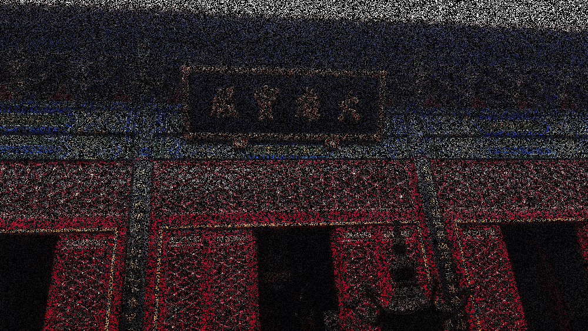
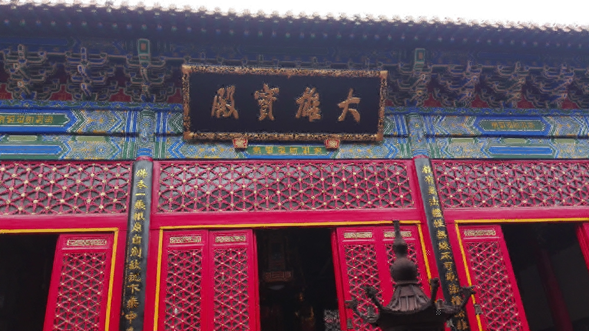

# Color-Image-Inpainting
- Image inpainting based on OMP and KSVD algorithm
- Course project of "Manifold Learning and Sparse Coding"(04804002) @ Peking University.

## Instruction

- run.m
  - Case 1: Interpolation 
  - Case 2: OMP
  - Case 3: KSVD

## Documentation

- [Class Report](report_inpainting.pdf)
- Course Note  [Manifold Learning and Sparse Representation(Zhouchen Lin)](http://www.cis.pku.edu.cn/faculty/vision/zlin/Courses/ML&SR/Manifold_Learning.pdf)

## Experiment

### Missing Image

### Inpainting Result Based on OMP Algorithm

### Inpainting Result Based on KSVD Algorithm

## Reference
- *Mairal J, Elad M, Sapiro G. Sparse representation for color image restoration[J]. IEEE Transactions on image processing, 2008, 17(1): 53-69.*
- *Elad M, Aharon M. Image denoising via learned dictionaries and sparse representation[C]//2006 IEEE Computer Society Conference on Computer Vision and Pattern Recognition (CVPR'06). IEEE, 2006, 1: 895-900.*
- *Zhang J, Zhao D, Gao W. Group-based sparse representation for image restoration[J]. IEEE Transactions on Image Processing, 2014, 23(8): 3336-3351.*
